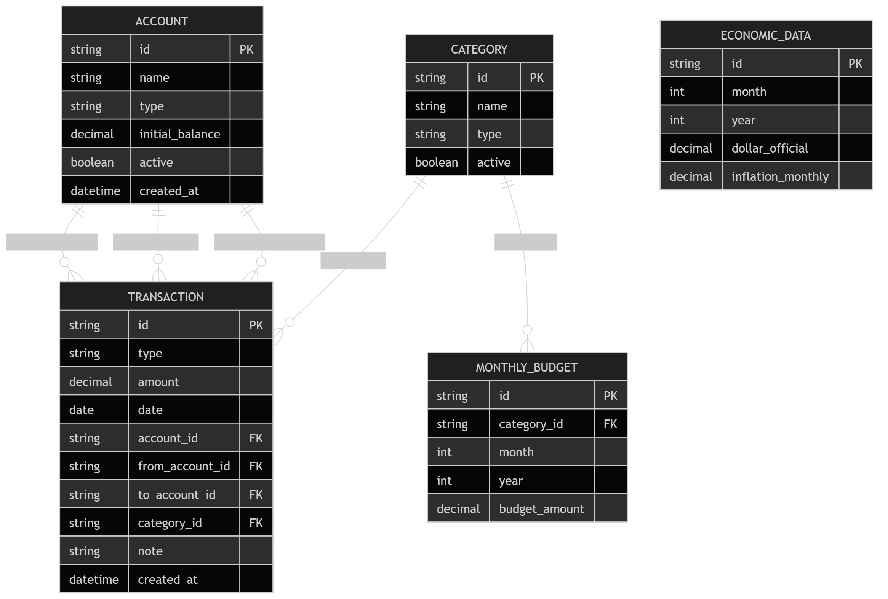

# Platita

<p align="center">
  
</p>

<p align="center">
  <strong>Una app de finanzas personales pensada para Argentina.</strong>
</p>

<p align="center">
  Registra ingresos, gastos, transferencias, presupuestos, cuentas de crédito e indicadores económicos en una base local, con una experiencia simple y enfocada en entender mejor tu plata.
</p>

<p align="center">
  
  
  
  
</p>

## Tabla de contenidos

- [Qué es Platita](#qué-es-platita)
- [Estado del proyecto](#estado-del-proyecto)
- [Capturas](#capturas)
- [Funcionalidades actuales](#funcionalidades-actuales)
- [Guía rápida de uso](#guía-rápida-de-uso)
- [Tecnologías y arquitectura](#tecnologías-y-arquitectura)
- [Persistencia, privacidad y seguridad](#persistencia-privacidad-y-seguridad)
- [Instalación y ejecución local](#instalación-y-ejecución-local)
- [Scripts disponibles](#scripts-disponibles)
- [Estructura del proyecto](#estructura-del-proyecto)
- [Documentación complementaria](#documentación-complementaria)
- [Roadmap](#roadmap)
- [Licencia](#licencia)

## Qué es Platita

**Platita** es una aplicación móvil de finanzas personales orientada a usuarios de Argentina que quieren llevar control de su dinero de forma manual, clara y rápida, sin depender de un backend ni de servicios de sincronización.

La propuesta del proyecto es:

- ser **local-first**
- priorizar una UX simple y usable en móvil
- ofrecer control sobre **cuentas reales y cuentas de crédito**
- incorporar contexto macroeconómico argentino, como inflación, dólar oficial y riesgo país
- mantener una base técnica moderna, tipada y fácil de evolucionar

## Estado del proyecto

Platita está en una etapa de **MVP funcional en desarrollo**.

Hoy ya permite:

- gestionar cuentas de efectivo, banco, billetera, inversión y crédito
- registrar ingresos, gastos, rendimientos y transferencias
- administrar categorías personalizadas
- configurar presupuestos mensuales por categoría
- consultar dashboard, actividad reciente e indicadores económicos en vivo
- proteger la app con huella o bloqueo del dispositivo
- persistir todo localmente con SQLite

Todavía no incluye:

- exportación/importación de backup funcional
- sincronización en la nube
- integración bancaria
- automatización completa de carga de movimientos

## Capturas

> Nota: el repositorio hoy versiona el branding del producto y un panorama general de navegación. Las capturas reales de pantallas todavía no están incluidas como assets del proyecto.

### Panorama general de navegación

<p align="center">
  
</p>

## Funcionalidades actuales

### 1. Dashboard de inicio

La pantalla principal ofrece una lectura rápida del estado financiero general:

- dinero total disponible
- ingresos, gastos y rendimientos acumulados
- tasa de ahorro
- distribución por cuentas
- análisis anual y tendencia reciente
- últimas actividades registradas
- bloque de contexto económico en vivo

### 2. Registro de movimientos

Puedes cargar movimientos desde una pantalla dedicada con validaciones y confirmación previa:

- ingreso
- gasto
- transferencia entre cuentas
- rendimiento

El formulario incluye:

- agrupación visual por bloques
- selector de cuenta o cuentas involucradas
- categoría según tipo
- fecha y nota opcional
- modal de confirmación antes de guardar

Además, la pantalla de movimientos permite:

- navegar por período
- filtrar por tipo, cuenta y categoría
- editar registros existentes
- eliminar movimientos con confirmación

### 3. Cuentas tradicionales y cuentas de crédito

Platita distingue distintos tipos de cuenta:

- `Efectivo`
- `Banco`
- `Billetera`
- `Inversión`
- `Crédito`

Las cuentas de crédito están pensadas para registrar consumos financiados. El flujo recomendado es:

- registrar compras como `gasto` sobre la cuenta crédito
- pagar el resumen como `transferencia` desde una cuenta real hacia la cuenta crédito

Eso permite separar mejor el gasto real del momento del pago.

### 4. Categorías

El proyecto incluye CRUD de categorías para:

- ingresos
- gastos
- rendimientos

Consideraciones importantes:

- las categorías del sistema `Sueldo` y `Rendimientos` están protegidas
- no aparecen en el CRUD
- no se pueden modificar ni desactivar desde la interfaz de categorías
- las categorías pueden activarse o desactivarse sin perder historial

### 5. Presupuestos mensuales

La sección de presupuestos permite definir un valor mensual por categoría de gasto y ver:

- presupuesto del período
- gasto acumulado
- restante
- porcentaje consumido
- estado visual del presupuesto

### 6. Indicadores económicos

Platita trabaja con dos capas de datos económicos:

#### Datos locales por período

Desde Ajustes puedes cargar manualmente por mes:

- dólar oficial
- inflación mensual

Estos valores quedan guardados en la base local.

#### Indicadores en vivo

En la pantalla de inicio también se muestran indicadores obtenidos desde APIs externas:

- inflación mensual
- inflación interanual
- riesgo país
- dólar oficial

Se complementan con una señal visual mínima de tendencia.

### 7. Seguridad opcional

La app permite activar un bloqueo opcional con autenticación del dispositivo:

- huella dactilar, si está disponible
- fallback al bloqueo del sistema cuando corresponde

No es obligatorio. El usuario puede activarlo o desactivarlo desde Ajustes.

## Guía rápida de uso

### Primer uso recomendado

1. Abre la app y define tu nombre visible.
2. Ve a **Ajustes** y crea tus cuentas principales.
3. Si usas tarjeta, crea una cuenta de tipo **Crédito**.
4. Activa el bloqueo de la app si quieres sumar privacidad.

### Cómo empezar a registrar tu plata

1. Entra en **Nuevo movimiento**.
2. Elige si vas a registrar un ingreso, gasto, rendimiento o transferencia.
3. Carga el monto, la cuenta, la categoría y la fecha.
4. Revisa el resumen del modal de confirmación.
5. Confirma el movimiento.

### Cómo usar una cuenta crédito

1. Crea una cuenta de tipo **Crédito** en Ajustes.
2. Registra las compras de tarjeta como `gasto` sobre esa cuenta.
3. Cuando pagues el resumen, registra una `transferencia` desde tu banco, efectivo o billetera hacia la cuenta crédito.

### Cómo trabajar con presupuestos

1. Ve a la pestaña **Presupuestos**.
2. Selecciona el período.
3. Configura un valor para cada categoría de gasto que quieras controlar.
4. Revisa el porcentaje consumido y el estado del presupuesto.

### Cómo cargar datos económicos

1. Entra en **Ajustes > Datos económicos**.
2. Elige el mes y el año.
3. Guarda el dólar oficial y la inflación mensual.
4. Vuelve al inicio para verlos reflejados en el panorama general.

## Tecnologías y arquitectura

### Stack principal

Platita está construida con:

- **Expo**
- **React Native**
- **React 19**
- **TypeScript**
- **Expo Router** para navegación basada en archivos
- **Expo SQLite** para persistencia local
- **Zustand** para estado global liviano
- **React Hook Form + Zod** para formularios y validación
- **Expo Local Authentication** para bloqueo opcional de la app
- **React Native SVG** para visualizaciones simples

### Enfoque arquitectónico

El proyecto sigue una organización por features y capas:

- `src/app`: rutas y pantallas
- `src/features`: lógica de dominio, hooks, formularios y UI por módulo
- `src/database`: cliente SQLite, migraciones, repositorios y seeds
- `src/store`: estado global
- `src/components`: componentes compartidos
- `src/lib`: utilidades y helpers
- `src/theme`: tokens visuales

La base local SQLite es la **fuente de verdad** del sistema.

## Persistencia, privacidad y seguridad

### Persistencia

Los datos se guardan en una base **SQLite local** llamada `platita.db`.

Eso incluye, entre otros:

- cuentas
- categorías
- movimientos
- presupuestos mensuales
- datos económicos cargados manualmente
- perfil del usuario
- preferencia de bloqueo de app

### Privacidad

- la app no usa backend propio
- no sincroniza información financiera con la nube
- no utiliza `localStorage` como almacenamiento principal
- la información queda en el almacenamiento interno de la app

### Seguridad

- bloqueo opcional con autenticación del dispositivo
- fallback al método de desbloqueo del sistema cuando aplica
- modelo local-first para reducir exposición de datos remotos

### Integraciones externas

La app sí realiza consultas de red para el bloque de indicadores económicos en vivo. Actualmente consume fuentes externas para:

- inflación
- riesgo país
- cotización del dólar oficial

## Instalación y ejecución local

### Requisitos

- Node.js `>= 20.19.4`
- npm `10+`

### Instalación

```bash
npm install
```

### Ejecutar en desarrollo

```bash
npm run start
```

Luego puedes abrir el proyecto en:

- Android: `npm run android`
- iOS: `npm run ios`
- Web: `npm run web`

> Recomendación: para probar el bloqueo de la app y el flujo completo de autenticación, conviene usar dispositivo físico.

## Scripts disponibles

```bash
npm run start
npm run android
npm run ios
npm run web
npm run typecheck
```

## Estructura del proyecto

```text
src/
  app/
    (tabs)/
    accounts/
    backup/
    categories/
    economic-data/
  components/
  database/
    client/
    repositories/
    schema/
    seeds/
  features/
    accounts/
    budgets/
    categories/
    dashboard/
    economicData/
    salary/
    security/
    settings/
    transactions/
  lib/
  store/
  theme/
  types/
```

## Documentación complementaria

Si quieres profundizar en la base técnica del proyecto, aquí hay documentación adicional ya incluida en el repo:

- [Arquitectura general](./docs/ARCHITECTURE.md)
- [Esquema de base de datos](./docs/DATABASE_SCHEMA.md)
- [Especificación funcional del MVP](./docs/PLATITA_MVP_SPEC.md)
- [Navegación del producto](./docs/PLATITA_NAVIGATION.md)

## Roadmap

Líneas razonables para la próxima etapa del proyecto:

- exportación e importación de backups locales
- integrar de forma visible el análisis salarial dentro de la experiencia principal
- sumar pruebas automatizadas sobre servicios y repositorios
- pulir release y testing en dispositivo
- evaluar sincronización opcional en la nube en una etapa posterior

## Licencia

Este proyecto se distribuye bajo licencia [MIT](./LICENSE).