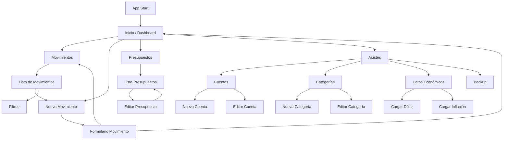

# Platita — Navigation Diagram

Este diagrama representa la navegación principal de la aplicación Platita (MVP).

## Navigation Flow

## Navigation hierarchy

Inicio
 ├── Movimientos
 │    └── Nuevo Movimiento
 ├── Nuevo Movimiento
 ├── Presupuestos
 │    └── Editar Presupuesto
 └── Ajustes
      ├── Cuentas
      │     ├── Nueva Cuenta
      │     └── Editar Cuenta
      ├── Categorías
      │     ├── Nueva Categoría
      │     └── Editar Categoría
      ├── Datos Económicos
      │     ├── Dólar
      │     └── Inflación
      └── Backup